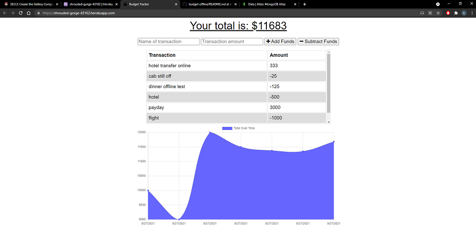

# budget-offline

## Description

A MongoDB/Mongoose PWA budget tracker! This APP has been updated to allow offline updates. Visit the site to start tracking !

## Table of Contents

- [Installation](#installation)
- [Usage](#usage)
- [Credits](#credits)
- [License](#license)
- [contributing](#contributing)
- [questions](#questions)

## Installation

Clone/Fork repo, install packages(npm install),start the server (npm start)

## Usage

To test the budget-tracker please visit this site. https://shrouded-gorge-43162.herokuapp.com/

## Credits

Jacob Banks

## License

This project is [Apache-2.0](https://choosealicense.com/licenses/apache-2.0/) licensed. 
Copyright © 2021 [jacob-banks](https://github.com/jacob-banks)

## Contributing

contributions welcome! fork/clone away.

## Questions

Contact Jacob Banks with any questions! 
Github link: [jacob-banks](https://github.com/jacob-banks) 
Email: kobybanks@gmail.com

